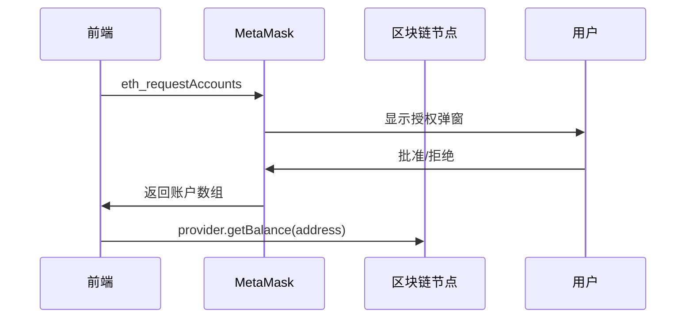
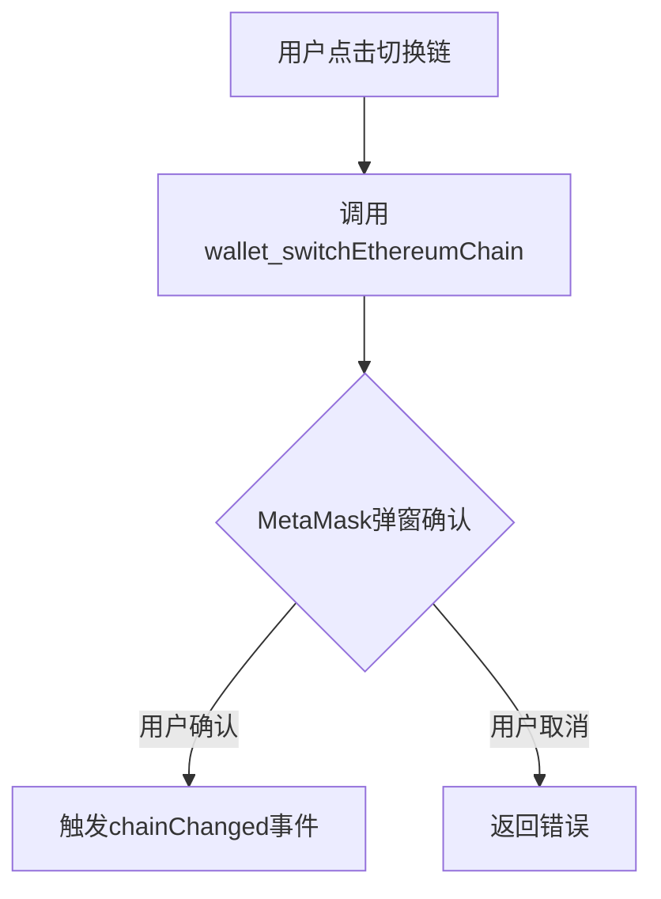

当然可以！下面是你 README.md 的内容，经过排版优化、格式统一、注释补全、代码高亮和中英文标点统一，便于阅读和团队协作。

---

# Day1 - Next.js 钱包连接基础

## ✅ 今日完成

- 初始化 Next.js 项目结构
- 搭建 src 目录规范
- 实现 MetaMask 钱包连接与余额读取
- 实现账号切换监听

---

## 📚 今日知识点

- ethers.js 的 provider 与 signer 用法
- MetaMask 链接流程：`eth_requestAccounts`
- Hook 设计：`useWallet` 管理地址和余额状态

---

## 🧱 项目结构

（此处可补充你的 src 目录结构树）

---

# Day 1: Web3 钱包连接核心实现

## 📚 技术要点总结

### 1. MetaMask 连接四步流程



---

### Q1: 如何检测用户是否安装了 MetaMask？

**标准答案：**

```typescript
function checkMetaMask(): boolean {
  return !!window.ethereum?.isMetaMask;
}
```

**加分回答：**

- 区分不同钱包提供商（Coinbase Wallet、Trust Wallet 等）
- 提供备选方案：显示钱包选择弹窗或下载引导

---

### Q2: 用户拒绝连接后如何优化体验？

**解决方案：**

```typescript
// 错误分级处理
enum WalletError {
  NOT_INSTALLED = 'METAMASK_NOT_INSTALLED',
  USER_REJECTED = 'USER_REJECTED',
  NETWORK_ERROR = 'NETWORK_ERROR'
}

// UI 层处理
switch (error.code) {
  case WalletError.USER_REJECTED:
    showToast('您已取消连接');
    break;
  case WalletError.NOT_INSTALLED:
    showModal(<WalletInstallGuide />);
    break;
}
```

---

### Q3: 为什么要在组件卸载时移除事件监听？

**技术要点：**

- 防止内存泄漏
- 避免 StrictMode 下的重复监听
- Next.js 等 SSR 框架会重复执行组件生命周期

**示例代码：**

```typescript
useEffect(() => {
  const handler = () => { /* ... */ };
  window.ethereum.on('accountsChanged', handler);

  return () => {
    window.ethereum?.removeListener('accountsChanged', handler);
  };
}, []);
```

---

### Q4: 如何实现多链切换后的自动刷新？

**企业级方案：**

```typescript
// 监听链变更
window.ethereum.on('chainChanged', (chainId) => {
  // 推荐方案：软刷新
  window.location.reload();

  // 高级方案：更新合约实例
  updateContracts(parseInt(chainId, 16));
});
```

---

如需补充项目结构树或其他内容，请告知！


是的，多链切换时需要同步更新账户状态是Day2要解决的核心问题。以下是完整的多链切换解决方案：

---

### 🌐 Day2 多链切换完整实现方案
### 🔍 核心问题解决方案

#### 问题：切换链后账户状态不同步
**原因分析**：
- 不同链的账户体系独立（如测试网和主网地址可能不同）
- 需要重新获取新链的账户信息

**修复方案**：
1. **强制刷新法**（推荐简单场景）：
   ```typescript
   window.ethereum.on('chainChanged', () => window.location.reload());
   ```

2. **精细状态管理法**（高级方案）：
   ```typescript
   window.ethereum.on('chainChanged', async (hexChainId) => {
     const newChainId = parseInt(hexChainId, 16);
     const accounts = await provider.send('eth_accounts', []);
     if (accounts.length > 0) {
       const balance = await provider.getBalance(accounts[0]);
       updateWalletState({
         chainId: newChainId,
         networkName: CHAIN_INFO[newChainId]?.name || 'Unknown',
         balance: ethers.formatEther(balance)
       });
     }
   });
   ```

---

### 🧪 测试用例
| 测试场景 | 预期结果 |
|---------|----------|
| 从ETH主网切换到Polygon | 页面刷新后显示Polygon链ID和该链余额 |
| 切换回原链 | 显示原链的地址和余额 |
| 切换链后断开连接 | 状态重置为未连接 |
| 不支持的目标链 | MetaMask显示错误提示 |

---

### 📝 Day2 技术文档补充
在 `docs/day2-notes.md` 中添加：

```markdown
## 多链切换核心逻辑

### 1. 链切换三阶段流程


### 2. 错误处理规范
```typescript
try {
  await switchChain(137);
} catch (error) {
  if (error.code === 4902) {
    // 链未添加到钱包，引导用户添加网络
    await addPolygonNetwork();
  }
}
```

### 3. 面试高频问题
**Q: 为什么切换链后需要刷新页面？**  
A: 两个主要原因：
1. 不同链的合约地址通常不同
2. RPC节点连接需要重新初始化

**Q: 如何优化链切换时的用户体验？**  
A: 三种方案：
1. 显示链切换加载状态
2. 预加载目标链的RPC节点
3. 使用WebSocket保持连接
```

---

### 🚀 下一步建议
1. 先实现基础链切换功能（强制刷新方案）
2. 测试通过后升级到精细状态管理方案
3. 添加链切换时的Loading状态

需要我提供更详细的错误处理示例吗？或是其他钱包（如WalletConnect）的多链实现方案？

# Web3 多钱包连接演示

这是一个基于 Next.js 和 WalletConnect 的多链钱包连接演示项目，支持 MetaMask 和 WalletConnect 两种连接方式。

## 功能特性

- 🔗 支持 MetaMask 和 WalletConnect 连接
- 🌐 多链支持（Ethereum、BNB Chain、Polygon）
- 🔄 网络切换功能
- 💰 余额显示
- 📱 响应式设计
- 🎨 现代化UI界面

## 技术栈

- **前端框架**: Next.js 15
- **钱包连接**: WalletConnect v2 + Web3Modal
- **状态管理**: Wagmi + Redux Toolkit
- **样式**: CSS + Tailwind CSS
- **语言**: TypeScript

## 安装和运行

### 1. 克隆项目
```bash
git clone <repository-url>
cd web3-next-wallet-demo
```

### 2. 安装依赖
```bash
npm install
```

### 3. 配置 WalletConnect Project ID

在 `src/providers/WalletConnectProvider.tsx` 文件中，将 `YOUR_PROJECT_ID` 替换为你的 WalletConnect Project ID：

```typescript
const projectId = "YOUR_PROJECT_ID"; // 从 https://cloud.walletconnect.com/ 获取
```

### 4. 启动开发服务器
```bash
npm run dev
```

访问 [http://localhost:3000](http://localhost:3000) 查看应用。

## 项目结构

```
src/
├── app/                    # Next.js App Router
├── components/             # React 组件
│   ├── NetworkSwitcher.tsx    # 网络切换组件
│   └── WalletSelector.tsx     # 钱包选择组件
├── hooks/                 # 自定义 Hooks
│   ├── useMultiWallet.ts      # 多钱包连接 Hook
│   └── useWallet.ts           # 基础钱包 Hook
├── providers/             # 提供者组件
│   ├── WalletConnectProvider.tsx  # WalletConnect 配置
│   └── WagmiProvider.tsx         # Wagmi 提供者
├── styles/               # 样式文件
│   ├── globals.css
│   ├── Network.css
│   └── WalletSelector.css
└── pages/                # 页面组件
    └── index.tsx             # 主页面
```

## 使用说明

### 连接钱包

1. 点击"选择钱包连接"
2. 选择 MetaMask 或 WalletConnect
3. 按照提示完成钱包连接

### 切换网络

连接钱包后，可以使用网络切换功能在不同链之间切换：
- Ethereum (Chain ID: 1)
- BNB Chain (Chain ID: 56)
- Polygon (Chain ID: 137)

## 获取 WalletConnect Project ID

1. 访问 [WalletConnect Cloud](https://cloud.walletconnect.com/)
2. 注册并登录账户
3. 创建新项目
4. 复制 Project ID
5. 在代码中替换 `YOUR_PROJECT_ID`

## 开发说明

### 添加新的链

在 `src/providers/WalletConnectProvider.tsx` 中添加新的链：

```typescript
import { mainnet, polygon, bsc, arbitrum } from 'wagmi/chains'

const chains = [mainnet, polygon, bsc, arbitrum];
```

### 自定义样式

修改 `src/styles/WalletSelector.css` 来自定义界面样式。

## 注意事项

- 确保在支持的浏览器中运行（Chrome、Firefox、Safari）
- MetaMask 需要用户手动安装浏览器扩展
- WalletConnect 支持移动端钱包应用
- 某些功能可能需要用户授权

## 许可证

MIT License
```

## Day 4：发送 ETH 与错误处理

### ✅ 实现内容
- 新增 `sendTransaction(to, amount)` 方法，支持 ETH 发送
- 处理错误码（特别是用户拒绝：4001）
- 添加状态提示、按钮加载等 UX 提升
- 创建了 `SendEthForm.tsx` 表单组件

### 📚 学到的点
- MetaMask 返回的错误对象结构：error.code
- 如何使用 signer 进行交易
- await tx.wait() 会等到链上确认

### 🧪 待测试
- 输入错误地址
- 金额不足
- 用户拒绝交易
- 正常成功交易

---

### 💡 面试常问：wagmi 如何解决钱包冲突与转账问题？

- **钱包冲突**：wagmi 通过 `connectors` 支持多钱包（如 MetaMask、WalletConnect），每次连接会自动切换当前活跃钱包，内部管理 session，避免多钱包冲突。
- **转账问题**：wagmi 推荐用 `useSendTransaction` 或直接用 ethers.js 的 signer 进行转账，能自动处理链切换、余额不足、用户拒绝等常见错误，并可通过 error.code 精准捕获用户行为。